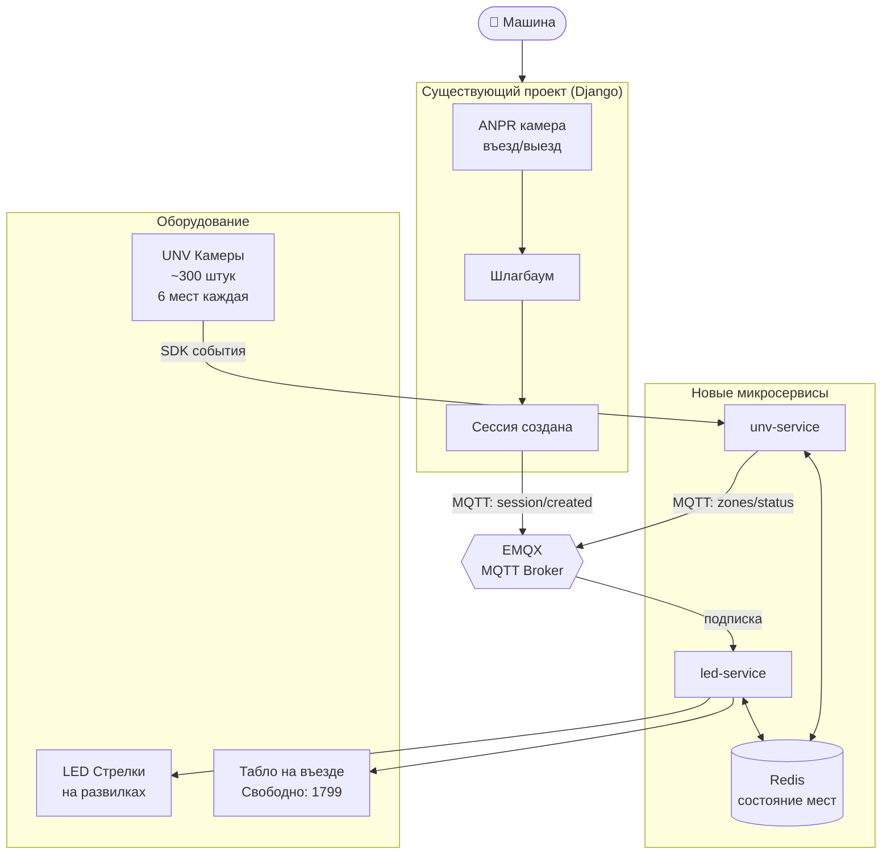
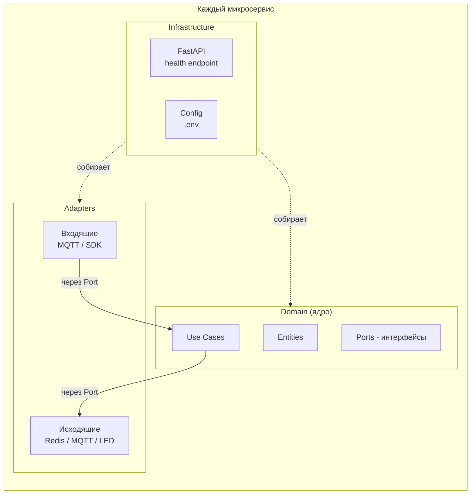
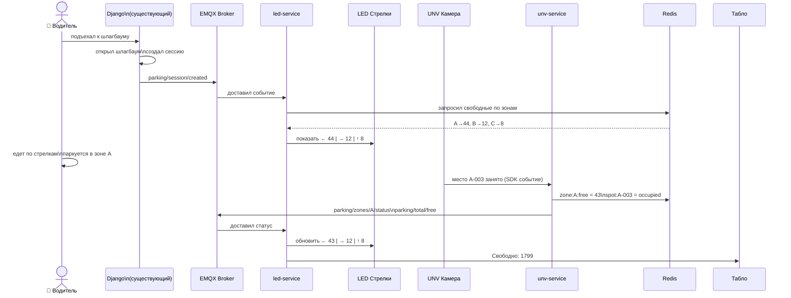
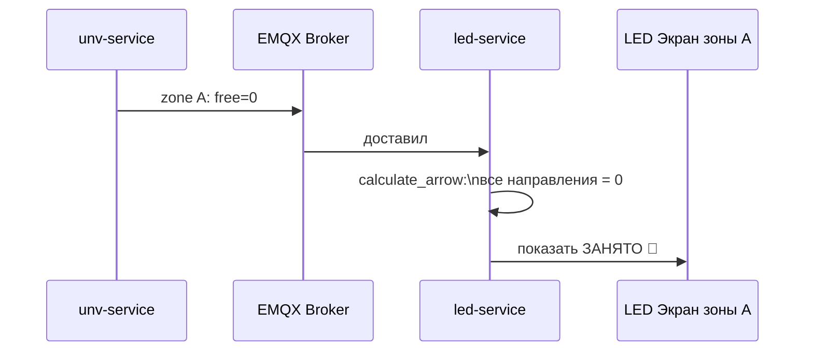
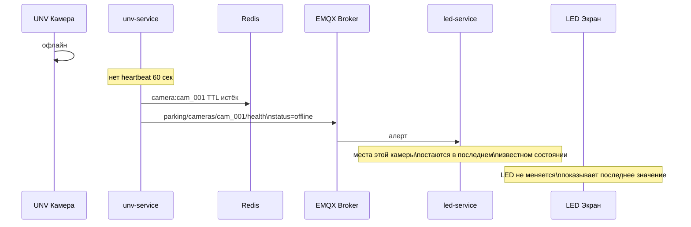
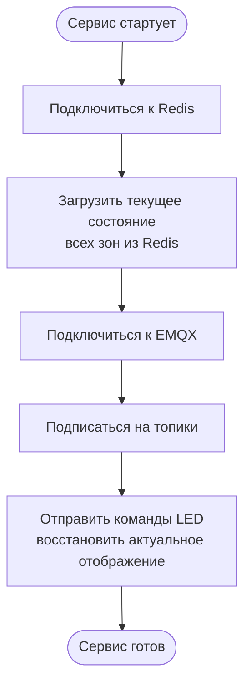
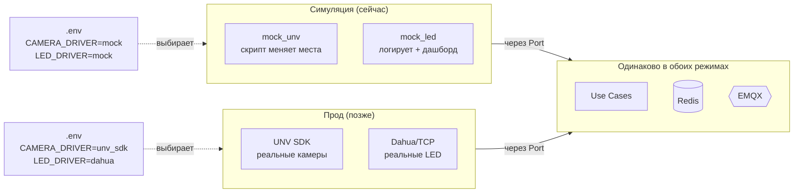

# SmartParking PGS — Архитектура

**Связано с:** [[Tech Stack]] |  [[Claude Notes]]
**Дата:** 2026-05-19
**Статус:** Проектирование

---

## Принцип

Два независимых микросервиса поверх существующего проекта.
Основной Django проект не трогаем — только добавляем новые сервисы рядом.
Симуляция и прод используют **одинаковую архитектуру** — меняется только конфиг.

---

## Общая картина системы



---

## Слои архитектуры — Hexagonal



**Правило:** Domain не знает ни про FastAPI, ни про Redis, ни про MQTT.
Всё внешнее — через интерфейсы (Ports). Это позволяет менять mock на реальное без изменения бизнес-логики.

---

## Сценарий 1 — Машина въезжает и паркуется



---

## Сценарий 2 — Зона заполнена



---

## Сценарий 3 — Камера отключилась



---

## Сценарий 4 — Рестарт сервиса



Redis сохраняет состояние между рестартами.
Сервис восстанавливает картину без ожидания новых событий с камер.

---

## Сценарий 5 — Переход с симуляции на прод



---

## Структура репозитория

```
smartparking-pgs/
│
├── unv-service/
│   ├── domain/          ← бизнес-логика, без зависимостей
│   ├── adapters/
│   │   ├── camera/      ← unv_sdk | onvif | mock
│   │   ├── mqtt/        ← publisher
│   │   └── redis/       ← repository
│   ├── config.py
│   └── main.py          ← FastAPI app + DI сборка
│
├── led-service/
│   ├── domain/          ← логика стрелок, без зависимостей
│   ├── adapters/
│   │   ├── display/     ← dahua | tcp | websocket | mock
│   │   ├── mqtt/        ← subscriber
│   │   └── redis/       ← repository
│   ├── config.py
│   └── main.py
│
├── simulator/           ← имитация оборудования
│   ├── mock_unv        ← имитирует UNV камеры
│   ├── mock_session    ← имитирует Django сессии
│   └── dashboard       ← веб-визуализация LED и мест
│
├── config/
│   ├── zones.json       ← карта зон и смежностей
│   ├── cameras.json     ← какая камера какие места
│   └── screens.json     ← какой LED на какой зоне
│
└── docker-compose.yml
```

---

## Redis — схема ключей

```
zone:{id}:free      → количество свободных (атомарный счётчик)
zone:{id}:total     → общее количество
zone:{id}:left      → смежная зона слева
zone:{id}:right     → смежная зона справа
zone:{id}:ahead     → смежная зона прямо
zone:{id}:screen    → id LED экрана этой зоны

spot:{id}:status    → free | occupied
spot:{id}:plate     → номер машины
spot:{id}:ts        → время последнего изменения

parking:total:free  → глобальный счётчик (для табло)
parking:total:total → 1800

camera:{id}:alive   → 1 (TTL 60 сек, истекает = камера offline)
```

---

*[[Tech Stack]] — технологии и почему*
*[[Simulation]] — как устроена симуляция*
*[[Claude Notes]] — заметки для будущих сессий*
