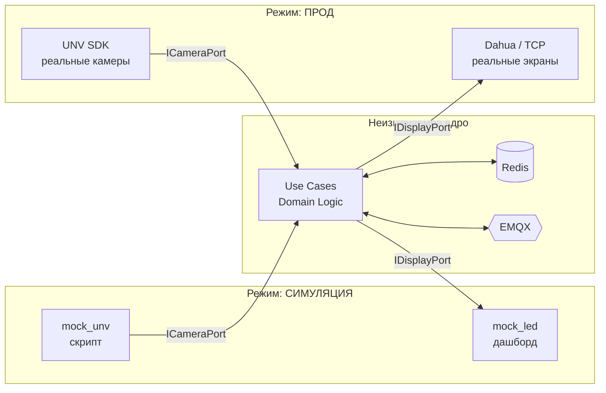
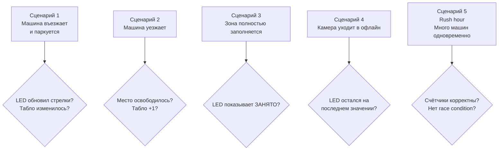
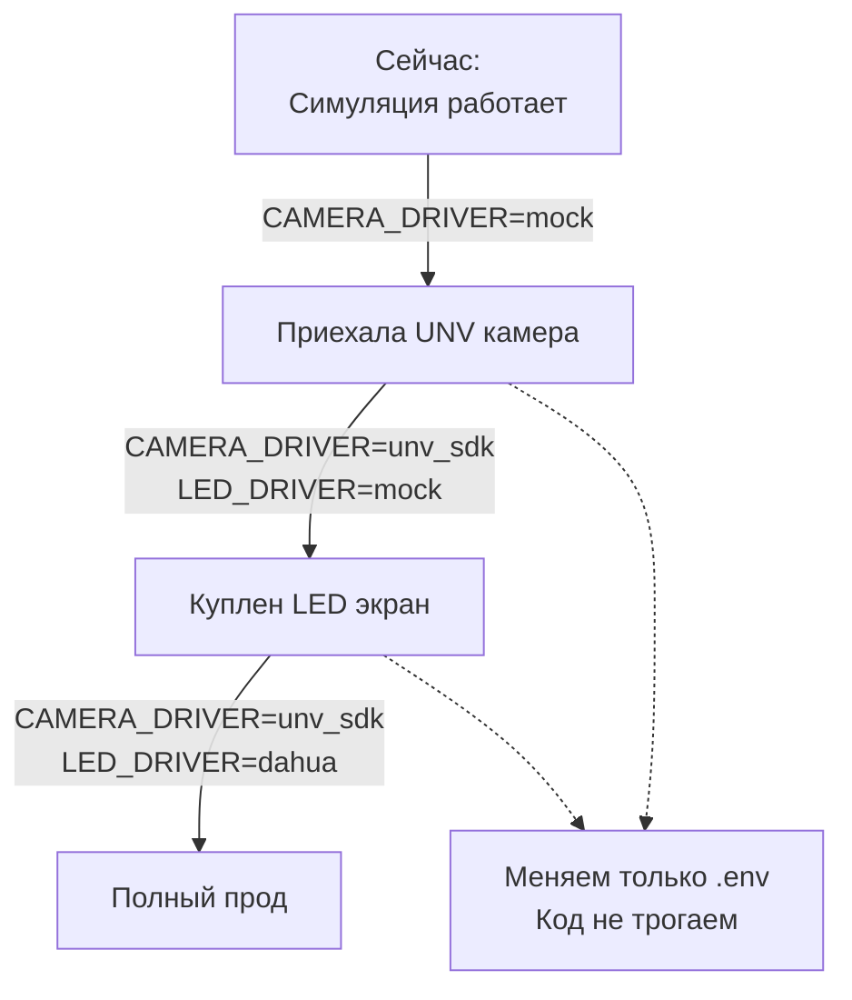

# SmartParking PGS — Симуляция

**Связано с:** [[Architecture]] | [[Tech Stack]]
**Дата:** 2026-05-19

---

## Принцип

Симуляция и прод используют **одну и ту же архитектуру**.
Меняется только адаптер — через переменную окружения.
Код сервисов не трогается при переходе на реальное оборудование.



---

## Компоненты симуляции

### mock_unv — имитация UNV камер

**Что делает:**
- Знает карту всех зон и мест (из `zones.json`)
- По таймеру случайно меняет статус места (свободно → занято → свободно)
- Публикует в MQTT те же топики что публиковал бы настоящий `unv-service`

**Режимы работы:**
- **Случайный** — места меняются случайно каждые N секунд
- **Сценарий** — заранее заданная последовательность событий для теста

---

### mock_session — имитация Django сессий

**Что делает:**
- Публикует в MQTT `parking/session/created`
- Имитирует что машина въехала и шлагбаум открылся
- Запускается вручную для тестирования реакции LED

---

### Dashboard — визуализация

**Что делает:**
- FastAPI сервер с WebSocket
- Слушает все MQTT топики
- Показывает в браузере в реальном времени:
  - Карту мест (зелёный = свободно, красный = занято)
  - Что показывает каждый LED экран (стрелки + цифры)
  - Табло на въезде

```mermaid
flowchart LR
    EMQX{{EMQX}} -->|все топики| DASH[Dashboard\nFastAPI]
    DASH -->|WebSocket| BROWSER[Браузер\nкарта парковки]
    BROWSER --> SPOTS[🟩🟥🟩 места]
    BROWSER --> LEDS[← 44 | → 12 LED экраны]
    BROWSER --> BOARD[Свободно: 1799 табло]
```

---

## Сценарии для тестирования



---

## Переход на прод



**Порядок перехода:**
1. Симуляция → тестируем всю логику без железа
2. Приехала UNV камера → переключаем `CAMERA_DRIVER=unv_sdk`, LED ещё mock
3. Купили LED экран → переключаем `LED_DRIVER=dahua`
4. Всё на проде — dashboard можно оставить для мониторинга

---

*[[Architecture]] — полная архитектура*
*[[Tech Stack]] — технологии*
